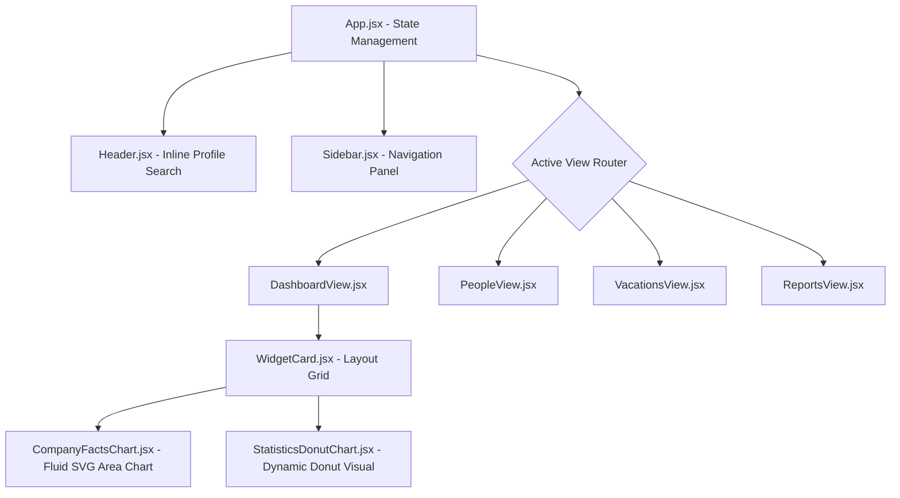

# 🌌 Camioca Admin Panel 2.0
> **An Enterprise-Grade, Hyper-Responsive React 18 + Vite Administrative Suite.**

[](https://react.dev)
[](https://vitejs.dev)
[](#-architecture--components-breakdown)
[](#-responsive-design-system)

---

## 🧭 Visual System Architecture



---

## ⚡ Core Pillars & Capabilities

### 📦 1. Next-Gen Component Architecture
Every dashboard widget, table, and data grid is decoupled as an isolated, state-controlled React component.
*   **Modular Rendering:** Data fetching hooks dynamically hydrate visualizations such as the **Company Facts Area Chart** and **Statistics Donut Chart**.
*   **Encapsulated Logic:** Header menus and account dropdown overlays auto-dismiss dynamically using React state-controlled outside-clicks.

### 📱 2. High-Fidelity Responsive Grid System
No layout shifting, zero horizontal scrolling, and completely fluid width percentages. Tested on target screen sizes:
*   **Tiny Viewports (320px - 360px):** Auto-scales UI, hides verbose text descriptions, collapses sidebar menus, and shrinks input paddings.
*   **Modern Viewports (375px, 390px, 414px, 430px):** Optimized using dynamic viewport percentage formulas to fit iOS & Android layouts natively.
*   **Tablets & Desktops (768px - 1440px+):** Elevates to double-column layouts and floats static elements seamlessly.

### 🔍 3. Micro-Interaction Profile Search
The search interface is inline and next to the user profile avatar, styled directly in [App.css](file:///c:/Users/User/Desktop/Admin%20panel%202/src/App.css):
*   **Zero-Border Styling:** Minimalist design with no background bounds.
*   **High Contrast:** Crisp `#3b82f6` color palette icons and gray placeholder inputs.
*   **Hover states:** Micro-transitions on inputs when selected or focused.

---

## 🎬 UI Motion & Micro-Animations

The interface uses standard fluid transitions and timing functions to create a highly responsive feel:
*   **Smooth Dropdowns:** Profile dropdowns smoothly transition using `transform` transitions:
    ```css
    transition: transform 0.15s cubic-bezier(0.4, 0, 0.2, 1);
    ```
*   **Hover Scaling & Active States:** All buttons (`.add-widget-btn`, `.submit-btn`) and navigation elements animate their background-colors and transforms on hover to provide natural tactile feedback.
*   **Input Glows & Transitions:** Input elements dynamically switch focus states with ease-in-out transition durations.

---

## 🛠️ Technology Ecosystem & Dependencies

*   **Runtime:** React 18 (Component state engine)
*   **Module Bundler:** Vite (Instant HMR & optimized production tree-shaking)
*   **Vector System:** SVG-based responsive math paths for dynamic charts.
*   **Icon Library:** Lucide React for pixel-perfect vectorized icon indicators.
*   **Color Palette:** Tailored HSL scheme.

---

## 🚀 Advanced Setup & Running Guide

### Development Pipeline
```bash
# Clone the repository
git clone https://github.com/sindhavdinesh/Admin-panel.git

# Navigate into root directory
cd "Admin panel 2"

# Install lockfile dependencies 
npm install

# Start local server with hot module replacement (HMR)
npm run dev
```

### Production Compilation
Optimize assets with Rollup and minify source files for hosting:
```bash
# Run production build
npm run build

# Preview production build locally
npm run preview
```

---

## 🎨 Enterprise Theme Customization Variables

Global styling utilizes CSS variables inside [index.css](file:///c:/Users/User/Desktop/Admin%20panel%202/src/index.css) to support easy branding tweaks:

```css
:root {
  --font-sans: 'Inter', system-ui, -apple-system, sans-serif;
  --bg-color: #f4f6f9;         /* Content base gray background */
  --primary-color: #24b47e;    /* Action green color button */
  --blue-active: #3b82f6;      /* Active state highlight blue */
  --border-color: #eef1f4;     /* Outer structure border tint */
}
```

---

## ✍️ Author & Maintainer

Developed with ❤️ by **[Sindhav Dinesh](https://github.com/sindhavdinesh)**.
